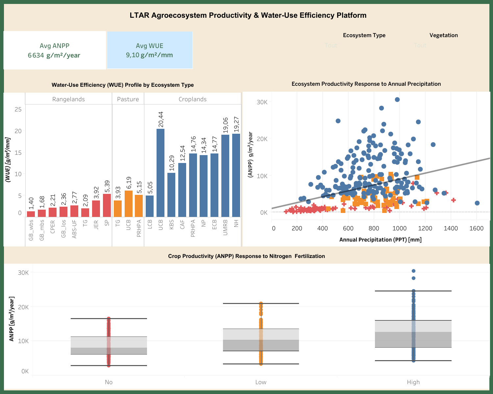

# 🌍 Global Agricultural & Rangeland Productivity Analytics (LTAR)

### 🎓 Project Context & Certification
This repository represents my **capstone project and final deliverable for the Codecademy BIDA (Business Intelligence & Data Analyst) Certification**. It demonstrates my ability to drive an analytics project end-to-end: formulating strategic business questions, performing data engineering, conducting rigorous statistical validation, and translating insights into actionable executive decisions.

---

## 📌 Business Case & Objectives
In the face of climate change and rainfall variability, optimizing agricultural resources and monitoring land resilience have become business-critical factors. Leveraging data from the **LTAR** (Long-Term Agroecosystem Research) network, this project addresses two core strategic business issues:
1. **Water Use Efficiency (WUE)**: How can we maximize biomass conversion efficiency across different ecosystems (Croplands, Pasture, Rangelands)?
2. **Fertilization Strategy (ROI & OPEX)**: How can we optimize crop yields under nitrogen fertilizer treatments while eliminating unnecessary spending (over-fertilization)?

---

## 📊 BI Delivery (Tableau Software)
The entire analytical process is synthesized into an interactive executive dashboard designed for strategic steering and managerial decision-making.

👉 **[Click here to view my interactive Tableau Public Portfolio](https://public.tableau.com/app/profile/willams.kevin.koin/vizzes)**

---

## 🚀 Strategic Recommendations & Business Impact

### 💧 Pillar 1: Water Resource Allocation (WUE Optimization)
- **Insight**: *Croplands* display the highest average water use efficiency, vastly outperforming *Pasture* and *Rangelands*.
- **Recommendation**: Prioritize irrigation infrastructure cap-ex and water-tech investments on *Croplands*, where every millimeter of water generates the highest biomass return on investment.

### 🧪 Pillar 2: Operational Cost Optimization (OPEX - Nitrogen)
- **Insight**: Soybean productivity remains strictly stable regardless of the nitrogen application level (No, Low, High). As a legume, soybean naturally fixes its own nitrogen.
- **Recommendation**: **Immediate cessation** of synthetic nitrogen fertilizer application on Soybean crops. This direct cost cut reduces OPEX with zero impact on yield. Reallocate 100% of these saved financial resources to Corn crops, which demonstrate a strong linear yield increase under *High N* regimes.

---

## 🛠️ Technical Competences Demonstrated
- **Data Engineering**: Data cleaning, schema harmonization, and restructuring of LTAR raw sources using Python (`pandas`, `numpy`, `pathlib`).
- **Advanced Statistical Analysis**: Pearson Correlation matrices, One-Way ANOVA tests, and Tukey's HSD Post-Hoc analyses (`scipy.stats`, `statsmodels`).
- **Business Intelligence**: Data modeling, star-schema structure, and interactive dashboard design in Tableau Desktop.
- **Automated Reporting**: Rapid data profiling via dynamic HTML reports (`ydata-profiling`).

---

## 📁 Repository Structure
- 📂 `dashboards/`: Tableau packaged workbook (`.twbx`) and high-resolution interface previews.
- 📂 `data/`: Inbound raw LTAR data and final structured clean datasets.
- 📂 `notebooks/`: Documented Python code covering the Exploratory Data Analysis (EDA) and hypothesis testing.
- 📂 `reports/`: Automated HTML profiling reports and executive summary PDF deliverables.
